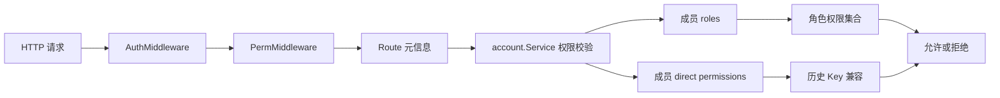

## User Requirements

为现有权限体系增加“角色定义”能力，让用户权限不再只依赖具体 API 路径；即使后续 API 路径、参数或路由结构发生调整，已分配给用户的权限也尽量不丢失。

## Product Overview

系统提供稳定的角色与权限定义。管理员可以通过角色为成员批量授权，成员登录后按角色获得对应功能访问能力；原有基于接口路径保存的权限需要继续兼容，避免升级后已有用户失去权限。

## Core Features

- 新增稳定权限标识：权限以固定业务标识表达，不直接绑定 API 路径。
- 新增角色定义：角色包含名称、描述和一组稳定权限，可复用于多个成员。
- 成员关联角色：成员可拥有一个或多个角色，并继续保留必要的直接权限配置。
- 兼容历史权限：已有按接口路径保存的权限继续可用，并逐步迁移到稳定权限。
- 权限展示优化：成员管理中按角色和权限分组展示，降低授权维护成本。
- 安全兜底：后端仍作为最终权限判断边界，未知或无效权限不得放大访问范围。

## Tech Stack Selection

- 后端：沿用 Go、Gin、现有 `internal/server` 路由注册与 `internal/service/account` 权限服务。
- 配置持久化：沿用 `config` 包和 `cstore` Provider，通过现有 `config.Load/Save` 链路保存 YAML 或 etcd 配置。
- 前端：沿用 `webview` 下 Vue 3、TypeScript、Pinia、现有账户成员管理页面。
- 文档：同步更新 `docs/references/system/account.md`、`docs/references/system/config.md`，必要时更新 `docs/SKILL.md`。

## Implementation Approach

采用“稳定权限 ID 加角色引用”的兼容演进方案：在后端 `Route` 元信息中新增稳定权限标识，权限校验时优先检查稳定权限 ID，同时兼容旧的 `METHOD /api/path` 路由 Key。角色定义放入配置层，成员通过 `roles` 引用角色，并保留 `permissions` 作为直接权限或历史兼容字段。

关键决策：

- 不移除现有 `permissions` 字段，避免配置升级后普通用户立即失权。
- `Route.Key` 继续用于展示、调试和历史兼容，新增字段作为授权主键，降低 API 路径变化带来的权限失效风险。
- 后端 `PermCheck` 改为接收完整路由元信息或稳定权限标识，统一计算成员有效权限。
- 角色定义集中在 `config` 与 `account service`，避免在 handler 中堆叠权限业务逻辑。
- 前端仅负责展示和提交角色、权限配置，真正授权仍由后端中间件强制执行。

## Implementation Notes

- 权限计算热路径在每次受保护 API 请求中执行，应使用本地 map/set 构建有效权限，避免每次多层切片线性扫描造成不必要开销。
- 历史权限兼容只做“允许旧 Key 继续生效”，不自动扩大为模块级权限。
- 未知角色、未知权限默认不授权；创建或更新成员时可返回明确校验错误。
- `founder` 保持绕过权限校验的现有语义，但前后端仍需保护内置关键资源。
- 配置保存必须走 `config.Save` 或现有封装，不能绕过 `CONFIG_PATH` Provider。
- 避免无关重构，不改动 Docker、APISIX、Caddy 等业务处理逻辑，只补充其路由权限元信息。

## Architecture Design

当前权限链路为：
请求进入 Gin 中间件，`PermMiddleware` 根据 `METHOD + FullPath` 找到 `Route`，再调用 `account.Service.PermCheck` 检查成员 `permissions`。

目标链路：

1. 路由注册时为需要权限控制的 `Route` 声明稳定权限 ID，例如 `docker.container.list`。
2. `PermMiddleware` 将完整路由元信息传给账户服务。
3. 账户服务读取成员配置，合并成员角色权限与直接权限，生成有效权限集合。
4. 校验优先匹配稳定权限 ID；历史配置中存在旧路由 Key 时继续允许。
5. `/account/routes` 返回稳定权限 ID、历史 Key、模块、标签、访问级别，供前端授权 UI 使用。
6. 成员管理 UI 支持编辑成员角色，并继续展示直接权限。



## Directory Structure

本次实现基于现有账户和权限模块扩展，不引入新的顶层架构。

```
/data/workspace/isrvd-new/
├── config/
│   ├── types.go
│   │   # [MODIFY] 新增 RoleConfig 及成员 roles 字段；保持 permissions 字段兼容历史配置。
│   ├── config.go
│   │   # [MODIFY] 初始化默认角色映射或空映射，确保旧配置加载后结构可用。
│   └── migrate.go
│       # [MODIFY] 如存在配置迁移逻辑，在此补充历史 permissions 到稳定权限的兼容迁移策略。
├── internal/
│   ├── server/
│   │   ├── app.go
│   │   │   # [MODIFY] Route 增加稳定权限字段，保留 key/module/label/access 输出兼容。
│   │   ├── middleware.go
│   │   │   # [MODIFY] 权限中间件改为基于 Route 稳定权限校验，并兼容旧 Key。
│   │   ├── ctrl_account.go
│   │   │   # [MODIFY] account 路由列表、成员接口返回角色与权限元信息；必要时新增角色查询接口。
│   │   └── ctrl_*.go
│   │       # [MODIFY] 为需要权限控制的已注册路由补充稳定权限 ID，不改变业务处理函数。
│   └── service/
│       └── account/
│           ├── service.go
│           │   # [MODIFY] 重构 PermCheck，合并角色权限、直接权限、历史路由 Key 并 fail-closed。
│           └── member.go
│               # [MODIFY] 成员请求和响应结构增加 roles，保存时校验角色和权限合法性。
├── webview/
│   └── src/
│       ├── service/
│       │   ├── api.ts
│       │   │   # [MODIFY] 对接角色查询或扩展后的账户接口。
│       │   └── types/account.ts
│       │       # [MODIFY] 增加 Role、稳定权限字段、MemberInfo.roles、MemberUpsert.roles 类型。
│       ├── stores/
│       │   ├── auth.ts
│       │   │   # [MODIFY] 读取成员 roles 和有效权限，保持权限加载状态逻辑。
│       │   └── portal.ts
│       │       # [MODIFY] 如当前 hasPerm 依赖权限数组，调整为稳定权限兼容判断。
│       └── views/account/
│           ├── members.vue
│           │   # [MODIFY] 成员列表展示角色摘要，保持现有成员管理入口。
│           └── widget/member-edit-modal.vue
│               # [MODIFY] 编辑成员时支持选择角色和直接权限，按模块分组展示。
├── docs/
│   ├── references/system/account.md
│   │   # [MODIFY] 更新成员、角色、路由权限接口说明和 bash 示例。
│   ├── references/system/config.md
│   │   # [MODIFY] 更新配置字段表，说明 roles 与 permissions 兼容关系。
│   └── SKILL.md
│       # [MODIFY] 若新增角色 API，在索引和决策树中补充入口。
└── config.yml
    # [MODIFY] 如仓库示例配置需要，补充 roles 示例；不得写入敏感信息。
```

## Key Code Structures

建议新增或调整的核心结构如下，具体字段名以实现时与现有风格统一为准：

```
type RoleConfig struct {
    Name        string   `yaml:"name" json:"name"`
    Description string   `yaml:"description" json:"description"`
    Permissions []string `yaml:"permissions" json:"permissions"`
}

type MemberConfig struct {
    Username      string   `yaml:"username"`
    Password      string   `yaml:"password"`
    HomeDirectory string   `yaml:"homeDirectory"`
    Founder       bool     `yaml:"founder"`
    Description   string   `yaml:"description"`
    Roles         []string `yaml:"roles"`
    Permissions   []string `yaml:"permissions"`
}

type Route struct {
    Key        string      `json:"key,omitempty"`
    Permission string     `json:"permission,omitempty"`
    Module     string     `json:"module"`
    Label      string     `json:"label"`
    Access     RouteAccess `json:"access"`
}
```

## Agent Extensions

### SubAgent

- **code-explorer**
- Purpose: 在实施前复核账户权限链路、配置结构、前端成员管理页面和文档影响范围。
- Expected outcome: 确认所有需要修改的文件、调用关系和兼容边界，避免遗漏权限热路径或文档同步点。